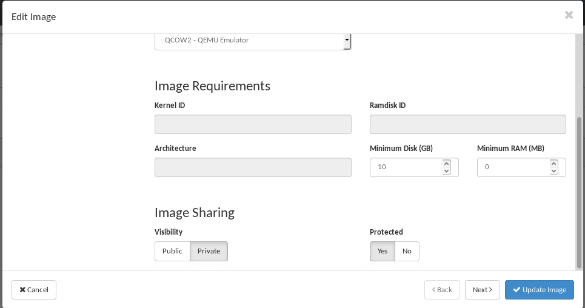
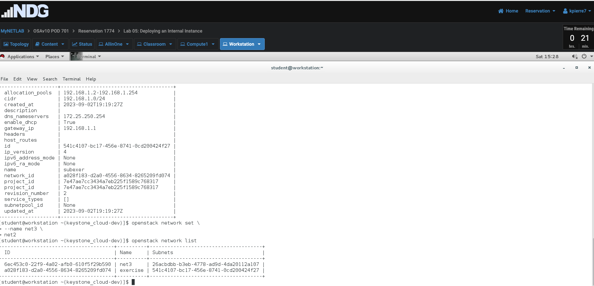
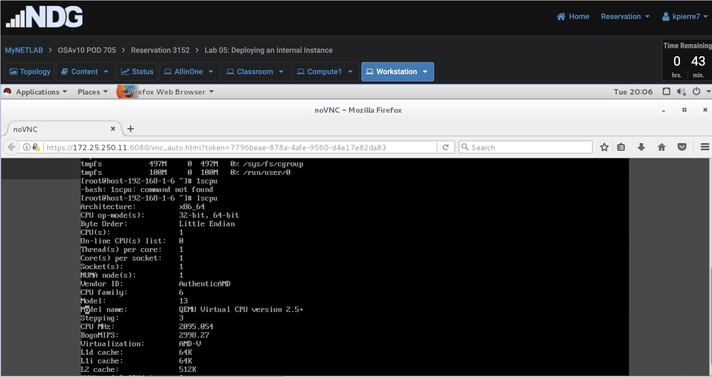
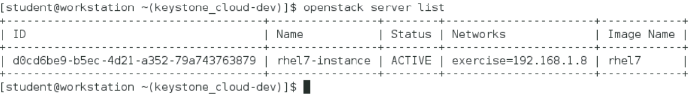

Lab 05 - Deploying an Internal Instance

1.  1.  Page 10 - Section 1, Step 9f - showing the *image2* image listed
        in the Horizon
        Dashboard.

    2.  Page 15 - Section 1, Step 13c - showing the details of
        the *rhel17* image.

    3.  Page 18 - Section 2, Step 5b - showing the newly
        created *flavor2* flavor.

    4.  Page 19 - Section 2, Step 6b - showing the details of
        the *m1.exercise* flavor.

    5.  Page 20 Section 2, the second Step 2b (after Step 6) - showing
        that the *flavor2* flavor has been deleted.
        

    6.  Page 24 - Section 3, Step 5e - showing the newly
        created *net2* network.
        

    7.  Page 27 - Section 3, Step 9b - showing the details of
        the *subexer* network.

    8.  Page 27 - Section 3, Step 10b - showing that network *net2* was
        renamed
        to *net3*.

    9.  Page 28 - Section 3, Step 11b - showing the details
        of *subnet2*.
        

    10. Page 29 - Section 3, Step 12b - showing that *net3* was
        deleted.

    11. Page 33 - Section 4, Step 5g - showing the newly
        created *instance5* instance.

    12. Page 34 - Section 4, Step 8c - showing that the
        instance *instance5* has been
        deleted.

    13. Page 35 - Section 4, Step 9b - showing that
        the *rhel7-instance* instance is running.
        

    14. Page 40 - Section 5, Step 6b - showing the RAM
        information.

    15. Page 40 - Section 5, Step 6c - showing the disk
        information.

    16. Page 40 - Section 5, Step 6d - showing the CPU
        information.

    17. Page 41 - Section 5, Step 7b - after this step, type in the
        command *openstack server list*.  Take a screenshot showing that
        the status of the instance is *PAUSED*.

>   alt="A screenshot of a computer Description automatically generated" />

18. Page 42 - Section 5, Step 7f - after this step, type in the
    command *openstack server list*.  Take a screenshot showing that the
    status of the instance is *SHUTOFF*. 

>  alt="A screenshot of a computer Description automatically generated" />

19. Page 42 - Section 5, Step 8b - after this step, type in the
    command *openstack server list*.  Take a screenshot showing that the
    status of the instance is *ACTIVE*.

>  alt="A close-up of a white background Description automatically generated" />

20. Page 43 - Section 5, Step 9b - showing that
    the *rhel7-instance* instance has been deleted.

>  alt="A screenshot of a computer Description automatically generated" />

2.  Submit your Lab file in Ivy Learn for the assignment.
